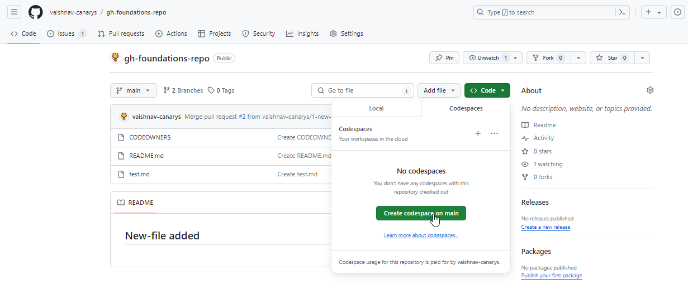
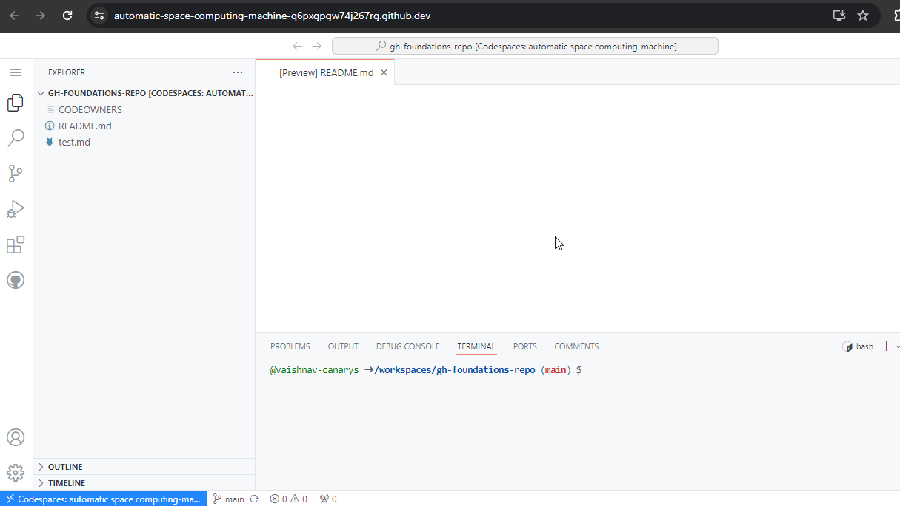
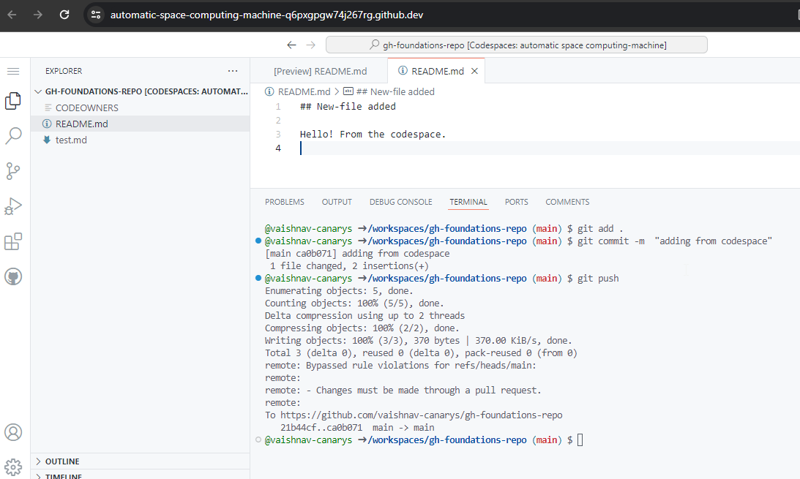
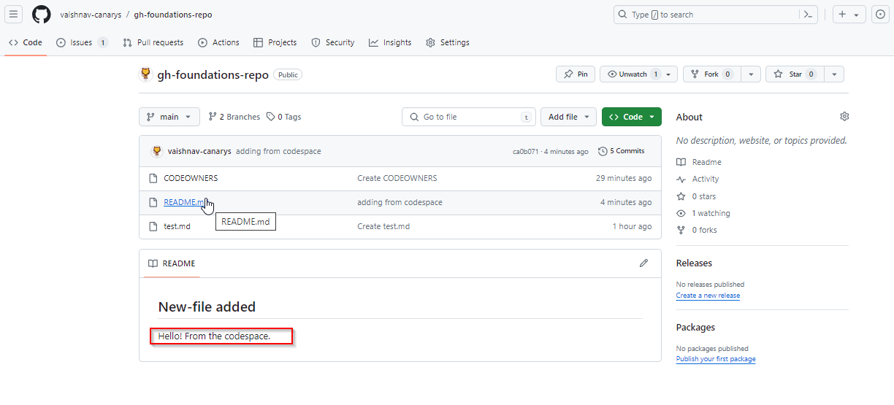

### Creating your first Codespace

In this hands-on lab your will create your first GitHub Codespace and learn how you can use Codespaces to work from anywhere from a browser. If you like more background information, please refer to the [GitHub Codespaces](https://docs.github.com/en/codespaces) pages on GitHub Docs.

### Creating first codespace
1. Navigate to your current repository
2. Under the repository name, use the  Code drop-down menu, and in the Codespaces tab, click Create codespace on main.





### Develop and push in a codespace
1. In the code folder open the readme.md file
2. Add the following in the readme.md file
```
Hello! From the codespace.
```
3. Save the file!
4. From the terminal run the following commands.
```
cd ..
git add *
git commit -m  "adding from codespace"
git push
```
5. You have now pushed code to your main repo! Codespace should look like this.



6. You can see the changes you have made in repo

