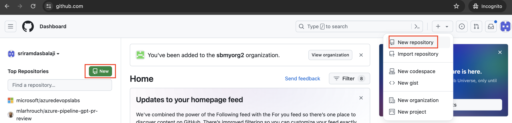
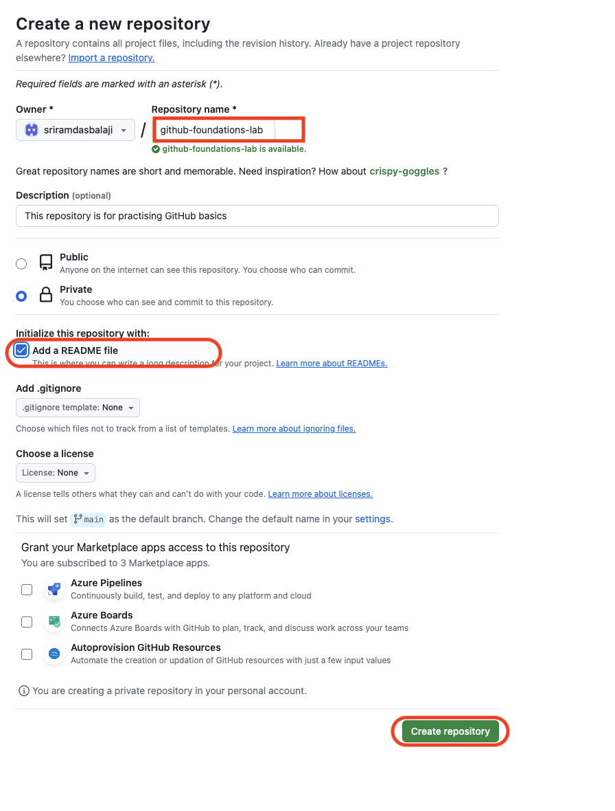
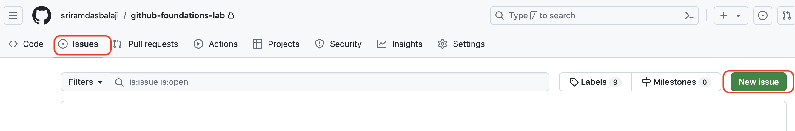
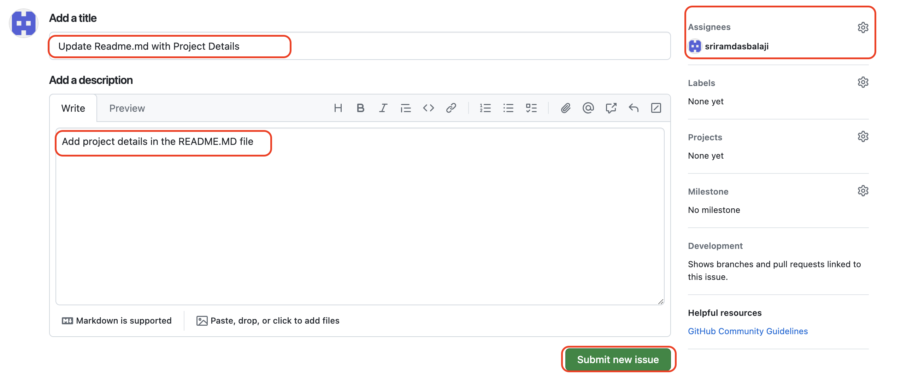
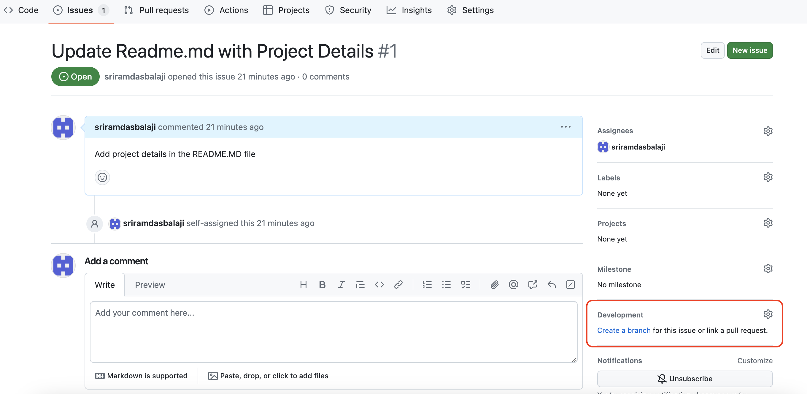
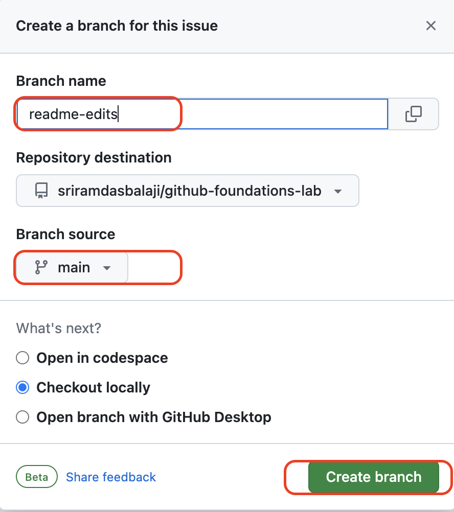
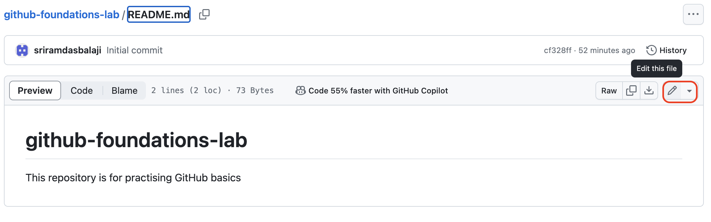
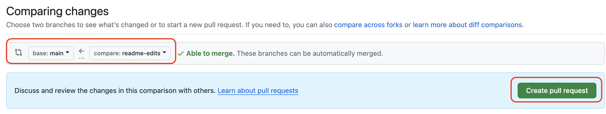

## Working with GitHub Repositories

### Overview
This lab guide you on GitHub essentials like repositories, branches, commits, and pull requests. You'll create your own  repository and learn GitHub's pull request workflow.

In this lab, you will:

- Create a repository.
- Create a new branch.
- Make changes to a file and push them to GitHub as commits.
- Open and merge a pull request.

### Prerequisites

- You must have a GitHub account. If you don't have, see "[Creating an account on GitHub.](https://docs.github.com/en/get-started/start-your-journey/creating-an-account-on-github)"

### Task 1: Create a GitHub Repository

A repository is the most basic element of GitHub. It's a place where you can store your code, your files, and each file's revision history.

1. Navigate to https://github.com/ and Sign in.
1. After Sign in, in the left side upper corner of the page, selct **New** (OR) in the upper-right corner of  page, select **+**, then click **New repository**.

   

1. In 'Create a new repository' page, in the "Repository name" box, type hello-world.

1. In the "Repository name" box, type hello-world.

1. In the "Description" box, type a short description. For example, type "This repository is for practising the GitHub Flow."

1. Select whether your repository will be **Public** or **Private**.

1. Select **Add a README file**.

1. Click **Create repository**.

     

### Task 2: Creating an issue from repository

Issues can be used to keep track of requirements, bugs, enhancements, or other requests. For more information, see "[About issues](https://docs.github.com/en/issues/tracking-your-work-with-issues/about-issues)."

Issues can be created in different ways. In this exercise we will see how to create from repository.

1. Under your repository name, click  **Issues** and then click  **New issue**

    

1. Enter the Title and Description of the Issue. For this lab exercise, let's assume we want to update the Readme.md file and incorporate the project details as the title and description of the issue. You can optionally assign the issue to yourself. Click on **Submit new issue**.

      
  
### Task 3: Create a branch

Branching lets you have different versions of a repository at one time.

1. You can create branch from **Code** tab. In this exercise let us create branch from the Issue. In the issue created, in the right sidebar under "Development", click **Create a branch**.

   

1. Enter branch name as **readme-edits**. Click **Create branch**

    

1. Now you have two branches, *main* and *readme-edits*.

### Task 4: Make and Commit Changes

1. In **Code** tab select **readme-edits** branch

1. Under the *readme-edits* branch you created, click the README.md file.

1. To edit the file, click Edit icon
    

    
1. In the editor, write a bit about yourself.
1. Click **Commit changes**.
1. In the **Commit changes** box, write a commit message that describes your changes.
1. Click **Commit changes**.

These changes will be made only to the README file on your *readme-edits* branch, so now this branch contains content that's different from *main*

### Task 5: Create a pull request

When you open a pull request, you're proposing your changes and requesting that someone review and pull in your contribution and merge them into their branch. Pull requests show diffs, or differences, of the content from both branches.

1. Click the **Pull requests** tab of your  repository.
1. Click **New pull request**
1. In the Comparing changes, select the branch you made, *readme-edits*, to compare with *main* (the original).
    
     

1. You can see your changes in the diffs on the Compare page.
1. Click **Create pull request**.
1. Give your pull request a title and write a brief description of your changes. 
1. Click **Create pull request**.

### Task 6: Review and Merge Pull request

When you are collaborating  with other developers, this is the time you'd ask for their review. Pull request allows  collaborators to comment on, or propose changes to, your pull request before you merge the changes into the main branch.

1. At the bottom of the pull request, click **Merge pull request** to merge the changes into *main*

1. Click **Confirm merge**. You will receive a message that the request was successfully merged and the request was closed.

1. Click back to the Code tab of your  repository to see your published changes on *main*.

As part of this lab, you've learned

- Create a repository.
- Start and manage a new branch.
- Change a file and commit those changes to GitHub.
- Open and merge a pull request.

### If time permits do below exercise

- Exercise 2: [Creating your first Code Space](/labs/codespaces.md)